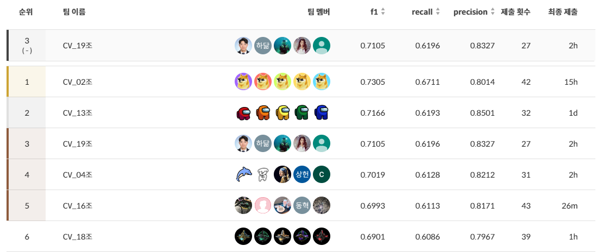

#데이터 제작 프로젝트

Naver BoostCamp AI Tech 4기 CV-19조 데이터 제작 프로젝트

**🏅리더보드(public) 3위/19팀중**

**🏅리더보드(Private) 6위/19팀중**

## 1. 프로젝트 개요

### 📙 프로젝트 주제 

- 학습 데이터 추가 및 수정을 통한 이미지 속 글자 검출 성능 개선 대회

- 📆 **대회 기간** : 2022.12.8 ~ 2022.12.15 

- 🛠 **개발 환경**
  - 개발 환경 : VSCode, Jupyter Notebook, GPU(Tesla V100)
  - 협업 Tools : GitHub, Notion, Zoom

## 2.  팀원 소개 

<table>
  <tr>
    <td align="center"><a href="https://github.com/zergswim"> <b>박민규 </b></a> </td>
    <td align="center"><a href="https://github.com/RADM90"> <b>박제원 </b></a> </td>
    <td align="center"><a href="https://github.com/hdak95"> <b>백하닮 </b></a> </td>
    <td align="center"><a href="https://github.com/JunghoYoo"> <b>유정호 </b></a> </td>
    <td align="center"><a href="https://github.com/ths3847"> <b>서성관 </b></a> </td>
    </tr>
</table>

### 👨‍👨‍👦‍👦 팀원 역할

|  팀원  |                             역할                             |
| :----: | :----------------------------------------------------------: |
| 박민규 | ICDAR 2015/2017 데이터 학습, hyperparameter 및 input/image size 테스트 |
| 박제원 | Validation 구현, Dataset 가공, AI-Hub 야외 실제 촬영 한글 이미지 데이터 실험 |
| 백하닮 | ICDAR 15,17,19 데이터 학습 |
| 유정호 | Crop, Color Jitter Augmentation, Validation 결과 분석 |
| 서성관 | AI-Hub, AI Stage 데이터 실험 및 데이터 Augmentation 방식 변경 |

## 3. Project 

### 📌 Process

1. Problem Definition

   > OCR task는 글자 검출 (text detection), 글자 인식 (text recognition), 정렬기 (Serializer) 등의 모듈로 이루어져 있습니다. 본 대회는 '글자 검출' task 만을 해결하게 됩니다. DetEval 방식으로 계산되어 진행됩니다. DetEval은, 이미지 레벨에서 정답 박스가 여러개 존재하고, 예측한 박스가 여러개가 있을 경우, 박스끼리의 다중 매칭을 허용하여 점수를 주는 평가방법 중 하나 입니다.
   
   **Input :** 글자가 포함된 전체 이미지
   **Output :** bbox 좌표가 포함된 UFO Format

2. EDA 및 추가 Dataset

  - ***대회에서 제공되는 데이터셋***
    - ICDAR17_Korean : ICDAR17-MLT 데이터셋에서 언어가 한글인 샘플들만 모아서 일부 영어 데이터를 추가하여 재구성한 것으로, 원본 MLT 데이터셋의 부분집합으로 별도 Cleaning이 필요하지 않을 정도로 잘 정리된 데이터셋.
    - 캠퍼들이 과제로 *직접 Annotation한 AI Stages 데이터셋 : 작업자별로 Annotation 가이드라인에 대한 이해가 달라서 잘못 라벨링된 경우가 많음.
    
  - ***추가로 사용한 데이터셋***
    - AI-HUB 야외 실제 촬영 한글 이미지 : 작은 텍스트, 영어 텍스트에 대한 정보가 없어서 학습 데이터로 이용 시 성능 저하됨. 또한 BBox 영역이 비대하여 `crop_img` 실행 시 텍스트 영역이 크게 소실되는 경우도 다수 발견되어 최종적으로 학습에 포함하지 아니하였음.
    - ICDAR15 : `illegibility: true`인  BBox들만 있는 이미지 존재, 사용 시 제거 필요. 한국어 샘플을 적게 포함.
    - ICDAR17 : 기본 제공 데이터셋인 ***ICDAR17_Korean***이 ******보다 정제된 데이터셋이라 판단하여 대체.
    - ICDAR19 : 위 ICDAR17 데이터셋과 같이 한국어를 제외한 비라틴 언어를 포함하지 않고 5,000장으로만 학습을 진행하기도 하였으나, 실제 성능은 전체 데이터셋 10,000장을 학습시킨 결과가 더 우수.

  - ***Synthetic Image***
    - 사용 안함.

3. Augmentation

  - ***적용한 방법***
    - resize, adjust height, rotate, crop, color jitter, normalize
  - ***Crop***
    - Crop 후, Ground Trugh의 BBox 꼭지점 4점이 모두 존재하지 않는 경우가 발생.
    - 잘린 글자에 대한 Annotation은 글자를 인식할 수 없으므로, Crop전에 Image 로드시 해당 Annotation은 제외됨.
    - Train/Validation 중 Augmentation 작업(Crop)으로 인해 글자가 잘리는 경우에도 해당 글자에 대한 데이터는 제거하지 않음.
    - 또한 Crop으로 인하여 잘리는 글자를 포함한 box의 수가 지나치게 많아질 수 있음.
    - 다만, Crop을 아예 제외하면 성능이 하락하므로, Crop을 유지하면서도 잘려지는 Box에 대한 적절한 처리가 필요하나, 시간 상의 제약으로 더 이상 진행하지 못함.
  - ***Color Jitter/Normalize***
    - Brightness(밝기), Contrast(대비), Hue(색조), Saturation(채도)의 기본값의 보정이 너무 심해서 오히려 성능을 떨어뜨리는 경우도 존재.
    - Color Jitter 의 파라미터를 조정하여 F1 스코어가 0.5347에서 0.5663으로 소폭 상승.

  4. Modeling
    - ***EAST 사용***
    - 모델의 수정은 세부규정에 의해 불가.

  5. Train & Validation
    - WandB를 사용하여 실험 관리
    - Early Stop 기능을 구현하여 Loss 값이 특정 Epochs가 경과하였음에도 갱신되지 않았을 때 학습을 중지하고 Best Validation Loss에 해당하는 Weight 값을 저장하도록 설정.
    - Validation에 사용되는 데이터셋 클래스는 기능을 Override하여 별도로 구현하지 않고 학습에 사용되는 데이터셋 클래스를 상속하여 원본 데이터의 경로만 변경하도록 설정.

### 📈 Train/Validation loss

### 🏁 Result

- 🏅 Public Leaderboard

  

- 🏅 Private Leaderboard

  

